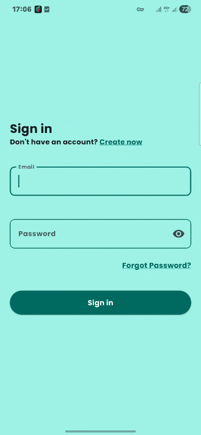

# Personal Finance Manager


A modern personal finance management application built with Flutter and Firebase that helps users track income and expenses, analyze spending habits, manage financial records, and stay organized through interactive statistics, charts, and smart reminders.

## Demo



## Features

### Authentication & Security

* Secure authentication with Firebase Authentication
* User registration and login
* Email verification workflow
* Password recovery via email
* Persistent authentication sessions
* Account deletion support
* Secure Cloud Firestore Security Rules
* User-specific data access control

### Transaction Management

* Add income and expense transactions
* Edit existing transactions
* Delete transactions
* Categorize transactions
* Cloud-synced transaction history
* Real-time data updates with Firestore

### Financial Analytics

* Interactive financial charts and analytics
* Income and expense visualization
* Category-based spending analysis
* Financial statistics and reports
* Transaction history overview

### User Experience

* Responsive UI for different screen sizes
* Material 3 design system
* Light and Dark theme support
* Daily reminder notifications
* User profile management
* Persistent user preferences

### Data Storage

* Cloud Firestore integration
* User profile storage
* Account creation timestamp tracking
* SharedPreferences for local settings persistence

## Data Export & File Management
* Export transaction history to CSV files
* Save exported reports locally on device
* File management and storage support

## Architecture

The application follows a scalable architecture with Riverpod for state management and Firebase services for backend functionality.

### State Management

* Riverpod

### Backend Services

* Firebase Authentication
* Cloud Firestore

### Local Storage

* SharedPreferences

### Notifications

* Flutter Local Notifications
* Timezone-aware notification scheduling

## Tech Stack

- Flutter
- Dart
- Riverpod
- Firebase Authentication
- Cloud Firestore
- SharedPreferences
- Flutter Local Notifications
- Syncfusion Flutter Charts
- CSV Export
- Material 3

## Highlights

* Secure authentication and authorization
* Firestore Security Rules implementation
* Cloud-synchronized financial data
* Interactive charts and financial insights
* Responsive Material 3 interface
* Theme customization (Light/Dark)
* Daily reminder notifications
* Scalable state management with Riverpod

## Getting Started

### Prerequisites

* Flutter SDK
* Firebase Project
* Android Studio or VS Code

### Installation

```bash
git clone https://github.com/your-username/flutter-expense-tracker.git
cd flutter-expense-tracker

flutter pub get
flutter run
```

### Firebase Setup

1. Create a Firebase project.
2. Enable Email/Password Authentication.
3. Create a Cloud Firestore database.
4. Add Firebase configuration files:

   * `google-services.json`
   * `GoogleService-Info.plist`
5. Run the application.

## License

This project is intended for educational, learning, and portfolio purposes.
